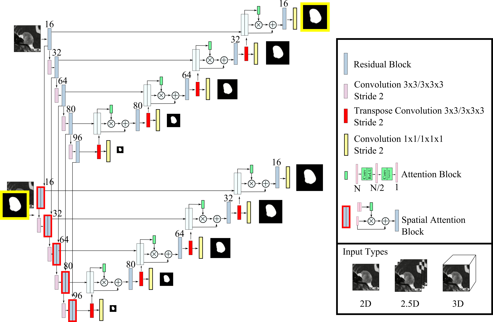
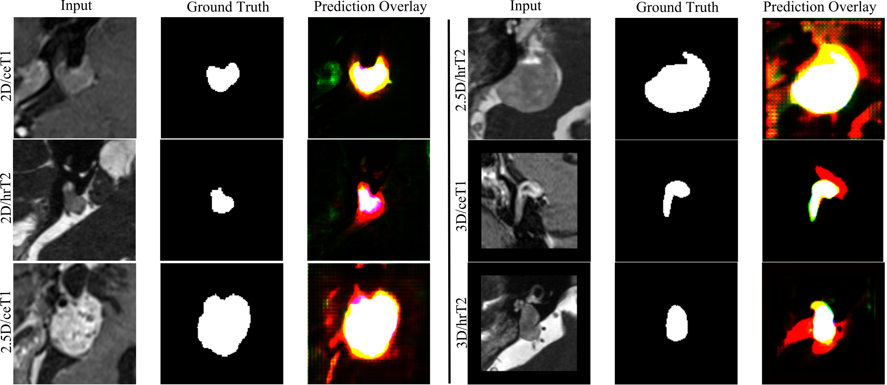

# CASCADENET: Automatic Segmentation of Vestibular Schwannoma from T1 and T2-Weighted MRI Using Deep Learning

## Table of Contents
1. [Introduction](#1-introduction)
2. [Installation](#2-installation)
3. [Usage](#3-usage)
4. [Results](#4-results)
5. [Dataset](#5-dataset)
6. [Model Architecture](#6-model-architecture)
7. [Images](#7-images)
8. [Citation](#8-citation)
9. [License](#9-license)

---

## 1. Introduction

CASCADENET is a deep learning model designed for the automatic segmentation of Vestibular Schwannoma (VS) from T1 and T2-weighted Magnetic Resonance Images (MRI). Management of VS necessitates accurate tumor size estimation, traditionally relying on linear dimensions. A more precise approach involves volumetric measurements over time. Both methods require manual tumor delineation in MRI slices, which is time-consuming and labor-intensive. Automatic segmentation is essential for enhancing clinical workflow and aiding patient management.

CASCADENET is a two-stage Convolutional Neural Network (CNN) model that simplifies the segmentation process. The first CNN generates an initial tumor region estimate, and the second CNN refines it using the predicted segmentation mask and input image. Spatial attention is incorporated by leveraging the first CNN's encoder features to enhance segmentation accuracy in the second CNN.

## 2. Installation

To use CASCADENET, you will need the following software and libraries:

You can install these dependencies using the following command:

```bash
pip install -r requirements.txt
```

## 3. Usage

To run the CASCADENET model for Vestibular Schwannoma segmentation, follow these steps:

1. **Data Preprocessing:**
   - Prepare your MRI data in the appropriate format.

2. **Model Training:**
   - Train the CASCADENET model on your dataset.

3. **Model Evaluation:**
   - Evaluate the model using publicly available or in-house datasets.

For more detailed instructions, please refer to the documentation or code provided in this repository.

## 4. Results

CASCADENET's performance has been evaluated on different datasets and MRI variations. Here are some key results:

- 3D CNN achieved a Dice score of 0.85 for T1-weighted MRI using a public dataset.
- Our proposed method using T1-weighted MRI on the public dataset achieved a Dice score of 0.89.
- In our in-house dataset, the Dice score using a 2D CNN was 0.79.
- Our method achieved a Dice score of 0.83 on the same in-house dataset.

## 5. Dataset

We used publicly available and in-house datasets for model evaluation. Please refer to the "Dataset" section of the code or documentation for more information on these datasets and their sources.

## 6. Model Architecture

For a detailed understanding of CASCADENET's architecture, please refer to the "Model Architecture" section of the code or documentation.

## 7. Images


*Architecture of CascadeNet*


*Qualitative Results*

## 8. Citation

If you use CASCADENET in your research or find it useful, please cite the following paper:

```
[Insert Citation Here]
```

## 9. License

This project is licensed under the [License Name], and the details of the license can be found in the "LICENSE" file.

For any questions or issues, please feel free to contact [Your Contact Information].

---

Thank you for using CASCADENET for Vestibular Schwannoma segmentation. We hope this tool will assist in improving clinical workflow and patient management in the field of medical imaging.